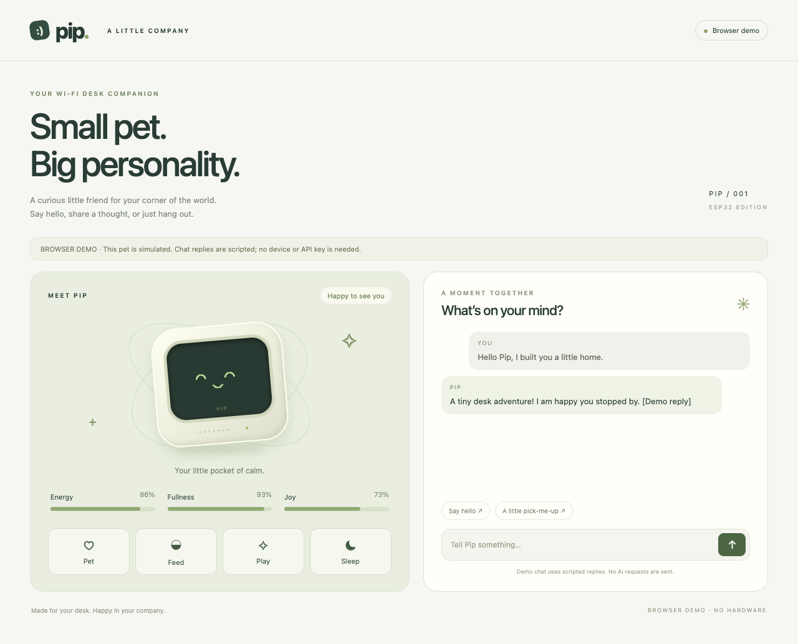

# ESP32 Desk Companion

A small Wi-Fi pet for your desk, with a local browser companion and a reusable firmware installer. Choose Pip, an original interactive pet, or use your own locally exported Codey artwork to mirror activity from the Codex desktop app.

| Firmware profile | Hardware | What it does |
| --- | --- | --- |
| `pip-tft` | ideaspark ESP32 with integrated ST7789, 170×320 | Animated Pip, care controls, optional AI replies |
| `codey-tft` | Same ideaspark TFT board | Codey animation, task names, model, cumulative tokens, task navigation |
| `pip-oled` | ESP32 DevKit + SSD1306 I²C, 128×64 | Monochrome Pip with the same care protocol |



## Install

Requirements: Python **3.11+**, Node.js **22.9+**, a data-capable USB cable, and a 2.4 GHz Wi-Fi network shared with your computer. The computer runs the companion while the pet is online. Build dependencies are installed in a project-local `.venv`.

Clone this repository or unpack a source release, then open a terminal in its folder:

```sh
./install.sh
```

On Windows, use `powershell -ExecutionPolicy Bypass -File .\install.ps1`, or use `python tools/install.py` on any platform. The guided installer chooses a profile, configures pairing, builds the firmware, and offers to flash a selected USB device. Flashing replaces that device's existing application; back up any firmware you need to retain first. It does not erase the entire flash or reset saved Wi-Fi credentials.

The installer and Pip builds are intended for macOS, Linux and Windows. macOS and Linux are verified; Windows support is currently untested. **Codey's desktop integration currently requires macOS**, the supported local Codex task-index schema, and an installed compatible desktop app. Codey can be cross-compiled with a supplied compatible sprite sheet.

### Explicit commands

```sh
./install.sh list
./install.sh bootstrap
./install.sh doctor
./install.sh devices

# Use your computer's LAN address, not localhost or the ESP32's address.
./install.sh configure --profile pip-tft --bridge-url http://192.168.1.50:8787
./install.sh build --profile pip-tft
./install.sh flash --profile pip-tft --port /dev/cu.YOUR_USB_PORT
./install.sh wifi --port /dev/cu.YOUR_USB_PORT
```

The Wi-Fi command opens a local setup server: visit **http://127.0.0.1:8788**, enter the network credentials, then stop the setup server with Ctrl+C. Credentials are sent over USB and saved on the ESP32; they are not printed or stored in the repository. On Windows a serial port looks like `COM3`; on Linux it may be `/dev/ttyUSB0`.

Start the companion in a terminal:

```sh
./install.sh start
```

Open **http://127.0.0.1:8787**. For Pip controls, enter the pairing token from your local `.env` in the browser's pairing field. The installer creates matching private `.env` and `firmware/include/pet_config.h` files with a random token. Re-running configure preserves the token, existing Wi-Fi macros, custom pins and API key. Changing the computer's LAN address requires configure, rebuild and reflash. A DHCP reservation avoids this.

Build is compile-only. Flash always names a profile and either an explicit connected port or the only detected USB serial port. Device detection does not identify the attached display: choose the profile matching your actual wiring.

## Codey and the desktop app

```sh
./install.sh configure --profile codey-tft --bridge-url http://192.168.1.50:8787
./install.sh assets --profile codey-tft
./install.sh build --profile codey-tft
./install.sh flash --profile codey-tft --port /dev/cu.YOUR_USB_PORT
./install.sh hooks
./install.sh start
```

`assets` exports the compatible sprite sheet from your installed `/Applications/ChatGPT.app`. Use `--app /path/to/App.app` or `--sheet /path/to/compatible-sheet.webp` if needed. **OpenAI artwork is not included in this repository or release.** Generated artwork remains local and retains its owner's rights. See [Codey setup and limitations](docs/CODEY.md).

The display shows task names, project/model details and cumulative token totals. A BOOT tap cycles recently active tasks and opens the selected task in the desktop app. Holding BOOT for at least 800 ms and releasing restores automatic display rotation. “Recently active” means the task index changed within two minutes; it is not proof that a task is running. Lifecycle hooks add observed working, needs-input and finished states. Installing hooks preserves unrelated hooks; review and enable the installed definitions in the app's Hooks settings, then restart the app if necessary.

## Pip and optional AI

Pip runs its lifecycle on the device. Feed, play, pet, sleep and wake work without an API key. For AI replies, set `OPENAI_API_KEY` and optionally `OPENAI_MODEL` in the computer's private `.env`, then restart the companion. The API key stays on the computer; the ESP32 receives bounded captions and expressions.

Preview Pip without hardware:

```sh
npm run demo
```

The demo binds to loopback and simulates a pet. It refuses hardware heartbeats.

## Add a firmware variant

1. Add a named environment to `firmware/platformio.ini`, including its board, display driver, pinned dependencies and build flags.
2. Add a matching entry to `installer/profiles.json`:

```json
"my-pip-board": {
  "name": "Pip on my board",
  "environment": "esp32-my-board",
  "companion": "pip",
  "assets": "none"
}
```

3. Add the board's display implementation and pin configuration in the firmware, preserving the [companion protocol](docs/PROTOCOL.md).
4. Run configure, build and flash with `--profile my-pip-board`.

This installer builds the profiles in this source tree. Arbitrary vendor firmware needs its own PlatformIO environment and protocol integration. It does not automatically adapt display pins or convert unrelated firmware.

## Hardware

The ideaspark board uses ST7789 RAM 240×320 with a 170×320 visible area and X offset 35. Fixed PCB wiring: MOSI 23, SCLK 18, CS 15, DC 2, reset 4, backlight 32; BOOT is GPIO0. No external display wiring is required. GPIO0 held during reset enters the ROM bootloader.

The OLED profile uses SDA 21, SCL 22, address `0x3C`, and a momentary button from GPIO27 to GND. Use a 3.3 V compatible SSD1306 module. Check the board pin map before adapting another ESP32 family. Pin maps are in `docs/pinmap*.json`.

## Develop and release

```sh
npm test
python3 -m unittest discover -s tests -p 'test_*.py'
c++ -std=c++17 tests/pet_native.cpp -o /tmp/pet-test && /tmp/pet-test
c++ -std=c++17 tests/button_native.cpp -o /tmp/button-test && /tmp/button-test
./install.sh build --profile pip-tft
./install.sh build --profile pip-oled
./install.sh build --profile codey-tft  # needs local artwork
python3 tools/package.py --version 1.0.0
```

CI runs the software tests and builds all three profiles. Codey's CI build uses a synthetic sprite fixture to validate compilation; it does not distribute OpenAI artwork. Source packages are generated from a committed Git tree, with checksums and an exclusion check for credentials, firmware binaries and generated artwork. Build outputs contain your device pairing token and must remain private.

See [verification and known limits](docs/VERIFICATION.md), [protocol](docs/PROTOCOL.md) and [third-party notices](THIRD_PARTY.md). The local HTTP companion is intended for a trusted LAN, not Internet exposure. Stop it with Ctrl+C. To remove the installation, stop the companion, remove its exact observer entries through Hooks settings, then delete the folder; device firmware and Wi-Fi remain until reflashed/reset.
